<h1 align="center">
  <a href="https://ghostex.dev"></a> Ghostex
</h1>

<p align="center">
  <a href="https://github.com/maddada/Ghostex/stargazers"><picture><source media="(prefers-color-scheme: dark)" srcset="https://shieldcn.dev/github/stars/maddada/Ghostex.svg?variant=secondary&mode=dark" /></picture></a>
  <a href="https://github.com/maddada/Ghostex/releases/latest"><picture><source media="(prefers-color-scheme: dark)" srcset="https://shieldcn.dev/github/release/maddada/Ghostex.svg?variant=secondary&mode=dark" /></picture></a>
  <a href="LICENSE"><picture><source media="(prefers-color-scheme: dark)" srcset="https://shieldcn.dev/github/license/maddada/Ghostex.svg?variant=secondary&mode=dark" /></picture></a>
  <br />
  <picture><source media="(prefers-color-scheme: dark)" srcset="https://shieldcn.dev/badge/platforms-macOS%20%C2%B7%20Windows%20%C2%B7%20Linux%20%C2%B7%20Android%20%C2%B7%20iOS.svg?variant=secondary&mode=dark" /></picture>
</p>
<p align="center">
  <a href="https://discord.gg/df7b3G92CS"><picture><source media="(prefers-color-scheme: dark)" srcset="https://shieldcn.dev/badge/Discord-Join%20the%20community.svg?variant=branded&logo=discord&mode=dark" /></picture></a>
</p>
  
<p align="center">
  <strong>The native desktop app for Claude Code, Codex, OpenCode, and every other coding agent.</strong><br/>
  Chat with several agents side by side, review their work as they go, and keep steering from your phone.
</p>

<h3 align="center"><a href="#install"><ins>Download Ghostex</ins></a> &nbsp;·&nbsp; <a href="https://ghostex.dev">Website</a></h3>

<!-- &nbsp;·&nbsp; <a href="https://discord.gg/df7b3G92CS">Discord</a> -->

<p align="center">
  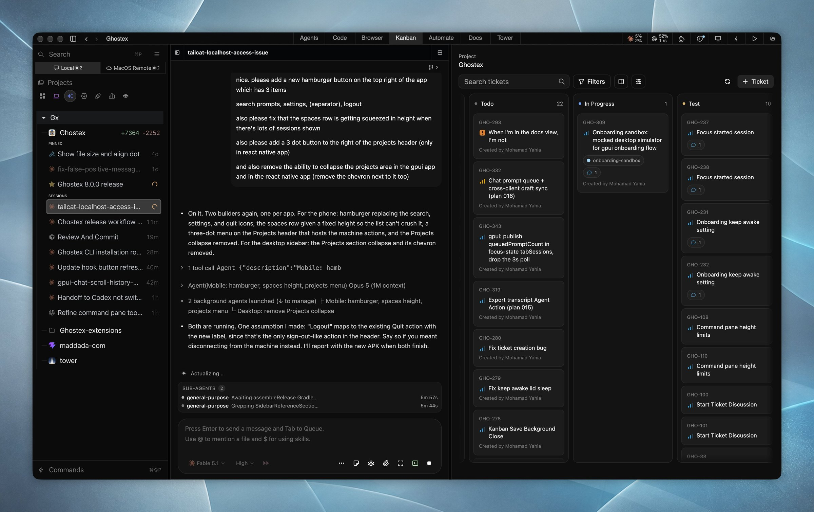
</p>

Ghostex is built for developers who keep many agents alive at once. A chat view for every agent, a native Rust/GPUI shell, embedded Chromium panes, and a mobile app share one workspace, and every session survives restarts.

## Features

<table>
<tr>
<td width="50%" valign="middle">

<br/>

### A real chat view for every agent

Talk to Claude Code, Codex, or any other agent in a proper chat GUI: clickable images, readable diffs, queued prompts, sub-agents in view, and a full editor for long messages. If you ever need the raw CLI, it is one hotkey away and your draft comes with you.

<br/>

</td>
<td width="50%">
  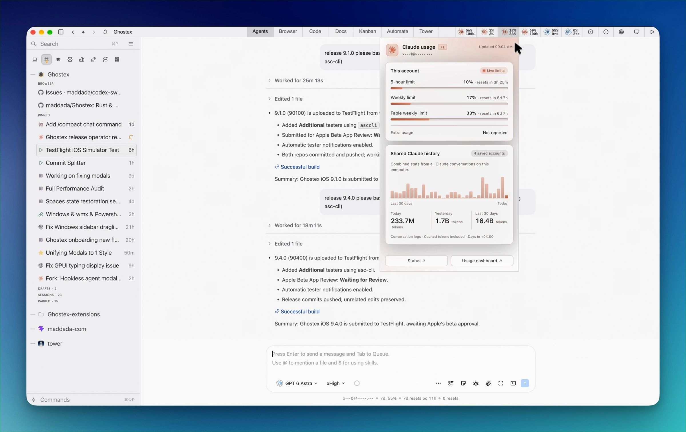
</td>
</tr>
<tr>
<td width="50%" valign="middle">

<br/>

### iOS and Android apps with Easy QR Connect or Tailscale

Your agents in your pocket. Easy QR Connect pairs your phone with a single scan, no extra accounts needed, or join through your Tailscale tailnet if you already have one. The app reconnects on its own when your network changes. Read transcripts, send follow-ups, preview localhost pages, and get a push when an agent finishes.

<br/>

</td>
<td width="50%">
  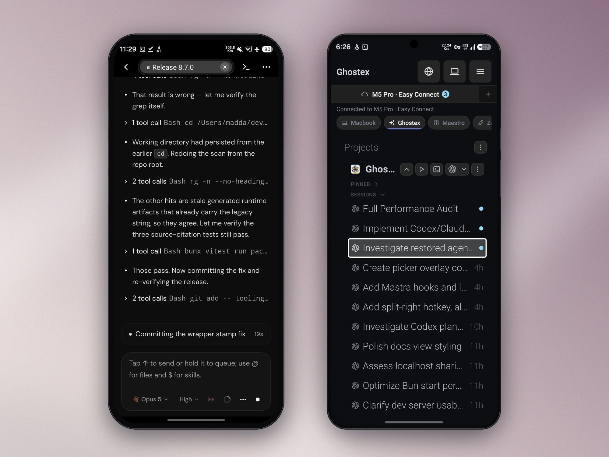
</td>
</tr>
<tr>
<td width="50%" valign="middle">

<br/>

### Any agent, swap on the fly

Claude Code, Codex, OpenCode, Pi, Gemini, Grok, Cursor, and more. Pick the model and effort from a radial menu, or hand a session from one agent to another mid-task.

<br/>

</td>
<td width="50%">
  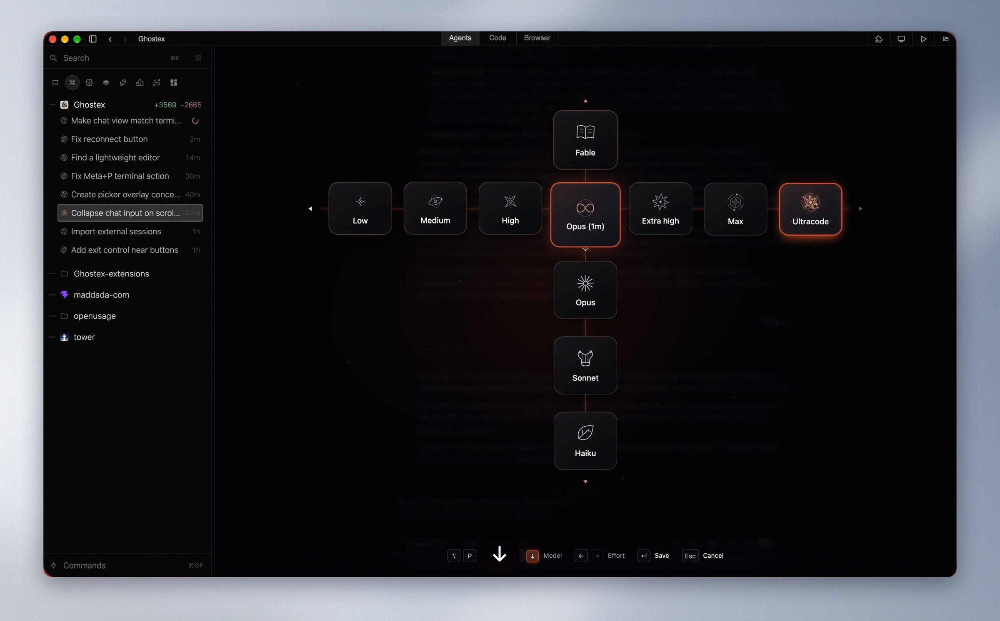
</td>
</tr>
<tr>
<td width="50%" valign="middle">

<br/>

### Embedded Chromium browser

Click any element, type what should change, and the note lands in the agent's prompt. Comes with profiles, Chrome DevTools MCP, and a browser-use skill so agents can drive your tabs.

<br/>

</td>
<td width="50%">
  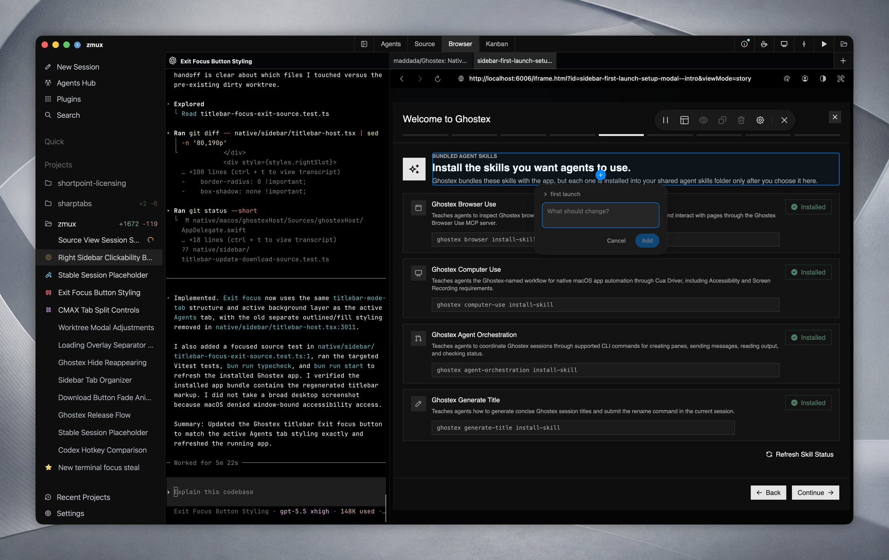
</td>
</tr>
<tr>
<td width="50%" valign="middle">

<br/>

### Kanban board on Beads

Dump your thoughts on the board, then let an orchestrator agent farm the tickets out to sub-agents. Runs on the [Beads](https://github.com/gastownhall/beads) `bd` CLI, so agents and humans share one backlog.

<br/>

</td>
<td width="50%">
  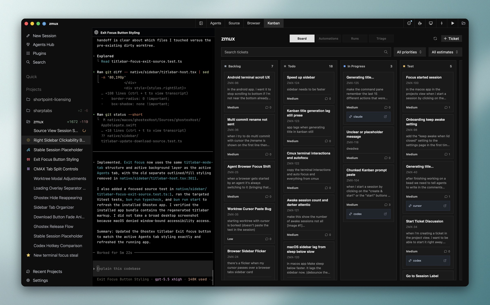
</td>
</tr>
<tr>
<td width="50%" valign="middle">

<br/>

### Docs with annotations

Open Markdown, HTML prototypes, and Excalidraw diagrams next to your agent. Select anything and leave a note; Ghostex turns your annotations into clear instructions the agent can act on.

<br/>

</td>
<td width="50%">
  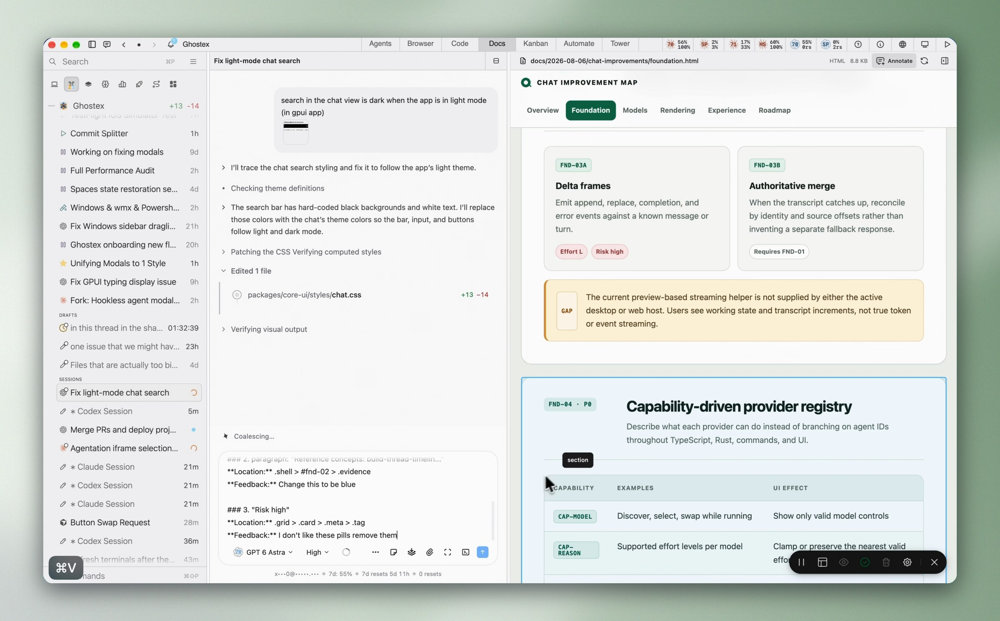
</td>
</tr>
<tr>
<td width="50%" valign="middle">

<br/>

### Rich prompt editor

Press Ctrl+G to edit any prompt in a full editor with hotkeys, image previews, and no more uneditable `[Pasted 50+ lines]` blocks. F1 lists every command.

<br/>

</td>
<td width="50%">
  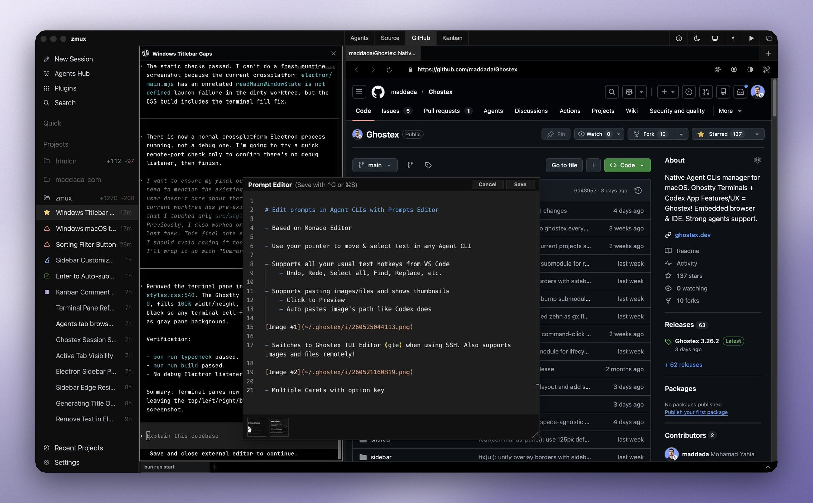
</td>
</tr>
<tr>
<td width="50%" valign="middle">

<br/>

### Built-in IDE

A VS Code editor that loads on demand for Markdown, code review, and PRs, supports all extensions, and sleeps when you are not using it.

<br/>

</td>
<td width="50%">
  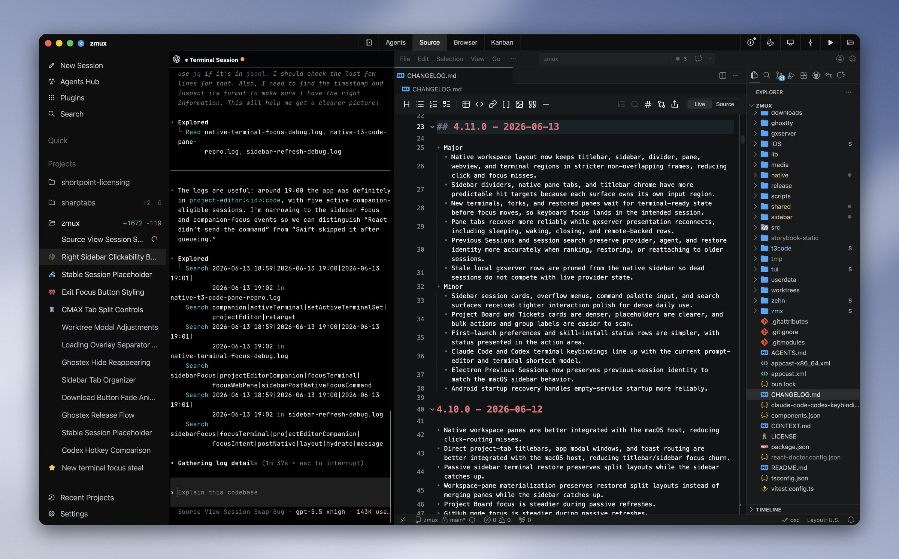
</td>
</tr>
<tr>
<td width="50%" valign="middle">

<br/>

### Find any past session

Fuzzy search every prompt you ever sent, across all your agents, and press Enter to resume the conversation. Star favourites and filter by agent or project. Also available as `gx f` for command-line fans.

<br/>

</td>
<td width="50%">
  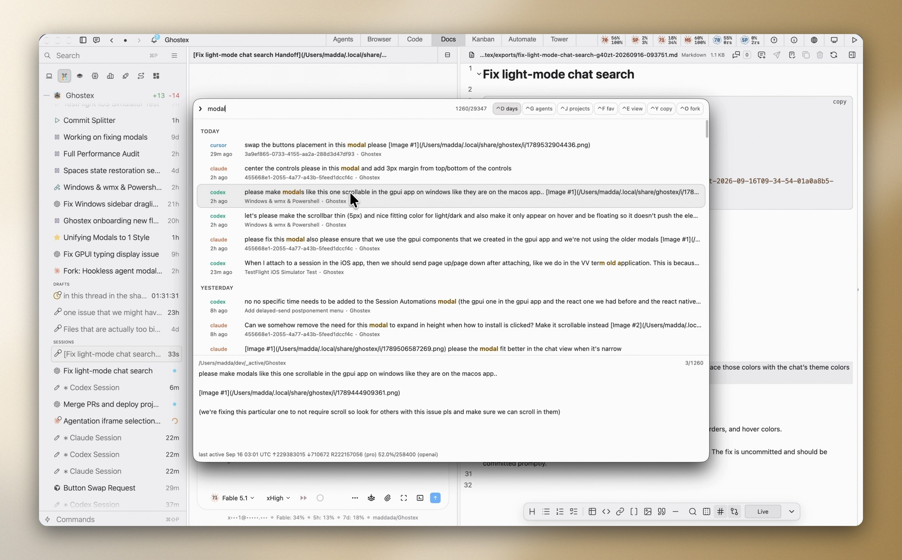
</td>
</tr>
<tr>
<td width="50%" valign="middle">

<br/>

### Agents that run agents

Agents can open sessions, send prompts, and read replies from other agents through the `ghostex` command. Ask Claude Code to spin up Codex sub-agents and steer them, or script it all yourself.

<br/>

</td>
<td width="50%">
  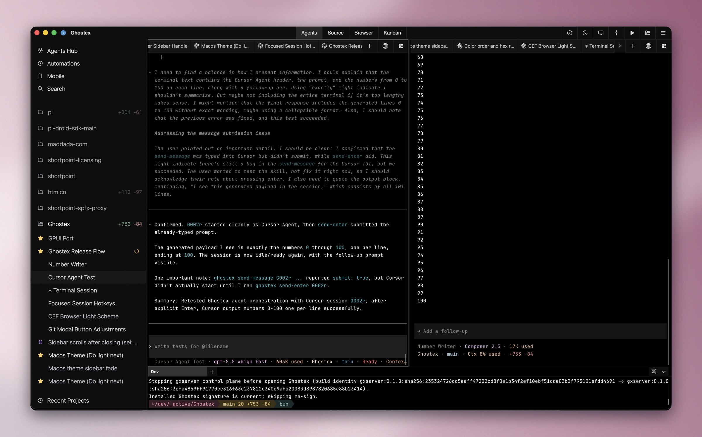
</td>
</tr>
</table>

**Also in the box:**

- **Remote machines**: install gxserver on another computer, connect with an Easy Connect code or SSH, and it shows up in the sidebar.
- **Usage and accounts**: Claude and Codex limits at a glance, with automatic account switching.
- **Worktrees, splits, and spaces**: create a worktree per task and merge it back, Cmd+D splits, Arc-style spaces.
- **Automations**: scheduled prompts and hooks, plus menu bar and sound notifications.
- **Optional extensions**: browser, Kanban, IDE, Docs, and automations load only when you use them. Or write your own.

---

## Supported agents

Works with **any coding agent**. Bring the one you already use.

<p>
  <a href="https://docs.anthropic.com/claude/docs/claude-code"><kbd> Claude Code</kbd></a> &nbsp;
  <a href="https://github.com/openai/codex"><kbd> Codex</kbd></a> &nbsp;
  <a href="https://opencode.ai"><kbd> OpenCode</kbd></a> &nbsp;
  <a href="https://pi.dev"><kbd> Pi</kbd></a> &nbsp;
  <a href="https://omp.sh"><kbd> oh-my-pi</kbd></a> &nbsp;
  <a href="https://github.com/google-gemini/gemini-cli"><kbd> Gemini CLI</kbd></a> &nbsp;
  <a href="https://x.ai/cli"><kbd> Grok</kbd></a> &nbsp;
  <a href="https://cursor.com/cli"><kbd> Cursor</kbd></a> &nbsp;
  <a href="https://github.com/features/copilot/cli"><kbd> Copilot CLI</kbd></a> &nbsp;
  <kbd>+ many more</kbd>
</p>

---

## Install

### macOS

```bash
brew install ghostex
```

Or download the app directly:

<p>
  <a href="https://maddada.com/download/macos-arm64"><picture><source media="(prefers-color-scheme: dark)" srcset="https://shieldcn.dev/badge/macOS-Apple%20Silicon%20DMG.svg?variant=secondary&logo=apple&mode=dark" /></picture></a>
</p>

### Windows (WSL2 beta)

<p>
  <a href="https://maddada.com/download/windows-x64"><picture><source media="(prefers-color-scheme: dark)" srcset="https://shieldcn.dev/badge/Windows-x64%20Setup.svg?variant=secondary&logo=windows&mode=dark" /></picture></a>
  <a href="https://maddada.com/download/windows-arm64"><picture><source media="(prefers-color-scheme: dark)" srcset="https://shieldcn.dev/badge/Windows-ARM64%20Setup.svg?variant=secondary&logo=windows&mode=dark" /></picture></a>
</p>

The Windows app targets WSL2 workflows: agents, gxserver, and the editor run inside your WSL2 distribution. Native Windows shells are not the intended setup yet. Updates arrive automatically from GitHub Releases.

### Linux

<p>
  <a href="https://maddada.com/download/linux-deb-x64"><picture><source media="(prefers-color-scheme: dark)" srcset="https://shieldcn.dev/badge/Linux-.deb.svg?variant=secondary&logo=debian&mode=dark" /></picture></a>
  <a href="https://maddada.com/download/linux-rpm-x64"><picture><source media="(prefers-color-scheme: dark)" srcset="https://shieldcn.dev/badge/Linux-.rpm.svg?variant=secondary&logo=redhat&mode=dark" /></picture></a>
  <a href="https://aur.archlinux.org/packages/ghostex-bin"><picture><source media="(prefers-color-scheme: dark)" srcset="https://shieldcn.dev/badge/AUR-ghostex--bin.svg?variant=secondary&logo=archlinux&mode=dark" /></picture></a>
  <a href="https://maddada.com/download/linux-tar-x64"><picture><source media="(prefers-color-scheme: dark)" srcset="https://shieldcn.dev/badge/Linux-tar.zst.svg?variant=secondary&logo=linux&mode=dark" /></picture></a>
</p>

```bash
# Arch Linux
yay -S ghostex-bin

# Any other x64 distribution: the tarball is a prefix-preserving /opt/ghostex tree
sudo tar -xpf ghostex-*-linux-x64.tar.zst -C /
```

The first GUI launch downloads the Chromium runtime into your cache directory.

### Mobile

<p>
  <a href="https://github.com/maddada/Ghostex/releases/latest/download/ghostex-android.apk"><picture><source media="(prefers-color-scheme: dark)" srcset="https://shieldcn.dev/badge/Android-APK.svg?variant=secondary&logo=android&mode=dark" /></picture></a>
  <a href="https://discord.gg/df7b3G92CS"><picture><source media="(prefers-color-scheme: dark)" srcset="https://shieldcn.dev/badge/iOS-TestFlight.svg?variant=secondary&logo=apple&mode=dark" /></picture></a>
</p>

The iOS TestFlight runs through the [Discord](https://discord.gg/df7b3G92CS). Post in the iOS channel to get in.

## Comparison

| Feature                   | Ghostex | Codex app | cmux |
| ------------------------- | ------- | --------- | ---- |
| macOS support             | Yes     | Yes       | Yes  |
| Windows support           | Yes     | Yes       | No   |
| Linux support             | Yes     | Yes       | No   |
| Open source               | Yes     | -         | Yes  |
| Ghostty terminal          | Yes     | -         | Yes  |
| Chromium Browser          | Yes     | Yes       | No   |
| Chat GUI view             | Yes     | Yes       | No   |
| Fully featured IDE        | Yes     | -         | -    |
| Built-in Computer use     | Yes     | Yes       | -    |
| Built-in Browser use      | Yes     | Yes       | Yes  |
| Use any model             | Yes     | -         | Yes  |
| Cross Model Orchestration | Yes     | -         | Yes  |
| Rich Prompt Editor        | Yes     | N/A       | -    |
| iOS                       | Yes     | Yes       | Yes  |
| Android                   | Yes     | Yes       | Yes  |
| Automations               | Yes     | Yes       | -    |

---

## Community

- **Discord:** [discord.gg/df7b3G92CS](https://discord.gg/df7b3G92CS) for help, TestFlight access, and feature talk.
- **Issues:** [Report a bug or request a feature](https://github.com/maddada/Ghostex/issues).
- **Contributing:** Ghostex moves fast and help is welcome on platform ports, agent integrations, docs, and polish. Start with [CONTRIBUTING.md](CONTRIBUTING.md).

<p align="center">
  <a href="https://github.com/maddada/Ghostex/graphs/contributors"><picture><source media="(prefers-color-scheme: dark)" srcset="https://shieldcn.dev/contributors/maddada/Ghostex.svg?bg=transparent&border=false&mode=dark" /></picture></a>
</p>

## Credits

Ghostex builds on open source work from these projects and communities:

- [Ghostty](https://github.com/ghostty-org/ghostty) and [Zed / GPUI](https://github.com/zed-industries/zed) for the terminal and the native shell
- [CEF](https://github.com/chromiumembedded/cef) for embedded Chromium panes
- [VS Code](https://github.com/microsoft/vscode) and [code-server](https://github.com/coder/code-server) for the embedded IDE
- [Beads](https://github.com/gastownhall/beads) by [Steve Yegge](https://github.com/steveyegge) and [Beads Viewer](https://github.com/Dicklesworthstone/beads_viewer) for the Kanban board
- [OpenUsage](https://github.com/robinebers/openusage) for Claude and Codex usage stats
- [Agentation](https://github.com/benjitaylor/agentation) for browser annotation tooling
- [cmux](https://github.com/manaflow-ai/cmux) for agent hook and notification patterns
- [zehn](https://github.com/al3rez/zehn) by [al3rez](https://github.com/al3rez) for prompt-history search
- [vvterm](https://github.com/vivy-company/vvterm) and [Termux](https://github.com/termux/termux-app) for mobile terminal components
- [Pierre](https://github.com/pierrecomputer/pierre) for diff and file rendering components

## License

Ghostex is free and open source under the [MIT License](LICENSE).
